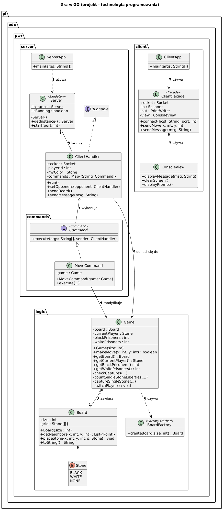

# Gra w GO (Projekt - technologia programowania)

## Autorzy
- [Jakub Kobus](https://github.com/jakubkobus) *283969*
- [Dawid Leśkiewicz](https://github.com/283974-dawidleskiewicz) *283974*

## Uruchomienie
### Serwer
```bash
mvn clean compile
mvn exec:java -Pserver
```

### Klient
```bash
mvn clean compile
mvn exec:java -Pclient
```

## Zastosowane wzorce projektowe
1. **Singleton** : `pl.edu.pwr.server.*`
2. **Facade** : `pl.edu.pwr.client.ClientFacade`
3. **Command** : `pl.edu.pwr.server.commands.*`
4. **Factory Method** : `pl.edu.pwr.logic.BoardFactory`

## Diagram klas
