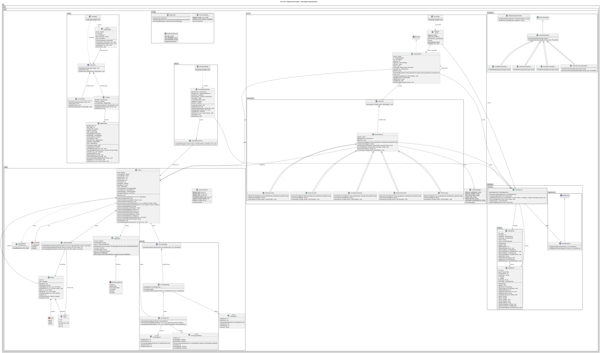

# Gra w GO (Projekt - technologia programowania)

## Autorzy
- [Jakub Kobus](https://github.com/jakubkobus) *283969*
- [Dawid Leśkiewicz](https://github.com/283974-dawidleskiewicz) *283974*

## Uruchomienie

### Wymagania wstępne
```bash
# Uruchom bazę danych PostgreSQL za pomocą Docker Compose
docker-compose up -d

# Sprawdź czy kontener działa
docker ps
```

Baza danych będzie dostępna na:
- **PostgreSQL**: `localhost:5432`
- **pgAdmin**: `http://localhost:5050` (admin@admin.com / admin)

### Serwer
```bash
mvn clean compile
mvn spring-boot:run -Pserver
```

### Klient (GUI)
```bash
mvn clean compile
mvn exec:java -Pclient
```

### Przeglądarka gier
```bash
mvn spring-boot:run -Pviewer
```

### Zatrzymanie bazy danych
```bash
docker-compose down
```

## Testowanie
```bash
# Uruchom wszystkie testy
mvn test

# Uruchom konkretną klasę testową
mvn test -Dtest=GameTest
```

## Generowanie dokumentacji JavaDoc
Aby wygenerować dokumentację JavaDoc dla projektu, uruchom:

```bash
mvn javadoc:javadoc
```

Wygenerowana dokumentacja będzie dostępna w katalogu `target/site/apidocs/`

## Architektura systemu

### Warstwa logiki gry (`pl.edu.pwr.logic`)
- **Game** - główna klasa zarządzająca stanem gry, ruchami i fazami rozgrywki
- **Board** - reprezentacja planszy z algorytmami sąsiedztwa
- **CaptureHandler** - wydzielona logika zbijania kamieni (SRP - Single Responsibility Principle)
- **MoveResult** - obiekt wyniku ruchu z szczegółowymi informacjami o błędach
- **GameConstants** - centralne stałe gry (rozmiary planszy, wartości domyślne)
- **BoardFactory** - fabryka do tworzenia i walidacji planszy

### Warstwa punktacji (`pl.edu.pwr.logic.scoring`)
- **IScoringStrategy** - interfejs strategii punktacji
- **ScoringStrategy** - implementacja tradycyjnego systemu punktacji
- **ScoringService** - serwis do obliczania terytoriów i walidacji ruchów cleanup
- **TerritoryResult** - obiekt wyniku obliczania terytoriów

### Warstwa serwera (`pl.edu.pwr.server`)
- **Server** - Singleton zarządzający połączeniami klientów
- **ClientHandler** - obsługa komunikacji z pojedynczym klientem
- **ServerMessages** - centralizacja komunikatów serwera
- **BaseCommand** - abstrakcyjna klasa bazowa redukująca duplikację w komendach
- **Command + implementacje** - wzorzec Command dla akcji graczy

### Warstwa klienta (`pl.edu.pwr.client`)
- **ClientFacade** - fasada ukrywająca szczegóły komunikacji sieciowej
- **GameView** - interfejs widoku (MVC)
- **GuiView + AppWindow** - implementacja GUI (JavaFX)
- **ConsoleView** - implementacja widoku konsolowego

### Warstwa bazy danych (`pl.edu.pwr.database`)
- **GameEntity, MoveEntity** - encje JPA reprezentujące gry i ruchy
- **GameRepository** - repozytorium Spring Data JPA
- **GameService** - serwis do zarządzania zapisem i odczytem gier

### Warstwa przeglądarki gier (`pl.edu.pwr.viewer`)
- **GameViewerApp** - aplikacja do przeglądania zapisanych gier
- **GameViewerWindow** - okno JavaFX do odtwarzania rozgrywek
- **GameViewerService** - logika odtwarzania ruchów

### Obsługa wyjątków (`pl.edu.pwr.exception`)
- **GoGameException** - bazowy wyjątek dla wszystkich błędów gry
- **InvalidMoveException** - nieprawidłowy ruch
- **GameOverException** - próba akcji po zakończeniu gry
- **WrongTurnException** - ruch poza kolejką
- **GamePersistenceException** - błędy zapisu/odczytu bazy danych
- **GlobalExceptionHandler** - centralny handler wyjątków

### Konfiguracja (`pl.edu.pwr.config`)
- **AppConfig** - konfiguracja Spring
- **ServerProperties** - właściwości serwera
- **DatabaseProperties** - właściwości bazy danych

## Zastosowane wzorce projektowe

1. **Singleton** - `Server` klasa z thread-safe implementacją (double-checked locking)
2. **Facade** - `ClientFacade` ukrywająca szczegóły komunikacji sieciowej
3. **Command** - Interfejs `Command` z abstrakcyjną klasą bazową `BaseCommand` i implementacjami: `MoveCommand`, `PassCommand`, `SurrenderCommand`, `RemoveCommand`, `FillCommand`
4. **Factory Method** - `BoardFactory` do tworzenia i walidacji planszy
5. **Strategy** - `IScoringStrategy` interfejs z `ScoringStrategy` implementacją do elastycznego obliczania wyniku gry
6. **Observer** - Pattern listener w `ClientFacade` nasłuchujący na wiadomości z serwera
7. **Model-View-Controller (MVC)** - `GameView` interfejs z implementacjami `ConsoleView` i `GuiView` (widok graficzny)
8. **Template Method** - `BaseCommand` definiuje szablon dla wszystkich komend z wspólną funkcjonalnością
9. **Result Object Pattern** - `MoveResult` jako bogate obiekty wynikowe zamiast prostych wartości boolowskich
10. **Service Layer Pattern** - `GameService`, `ScoringService`, `GameViewerService` jako warstwa logiki biznesowej
11. **Repository Pattern** - `GameRepository` do abstrakcji dostępu do danych

## Diagram klas

Pełny diagram architektury systemu (wszystkie klasy, interfejsy i relacje):

